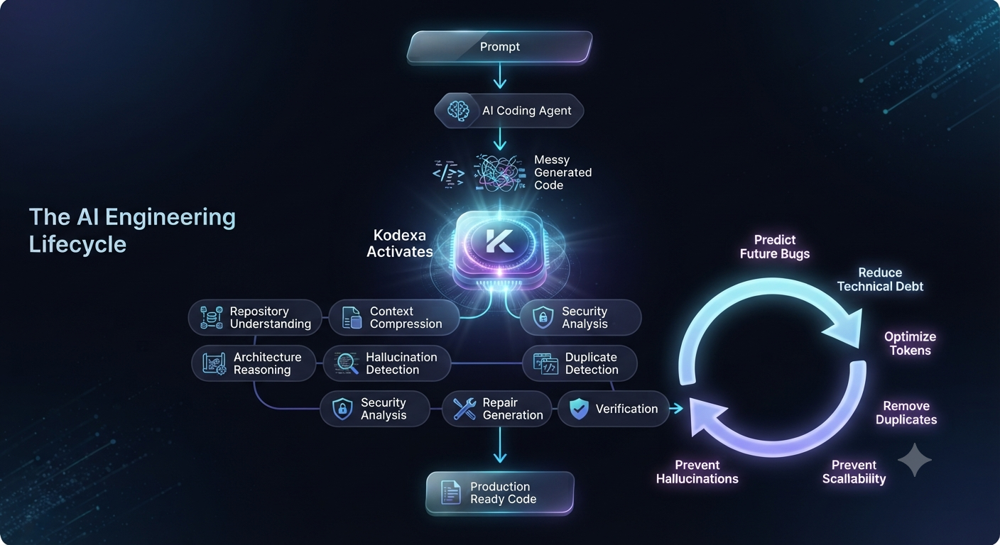
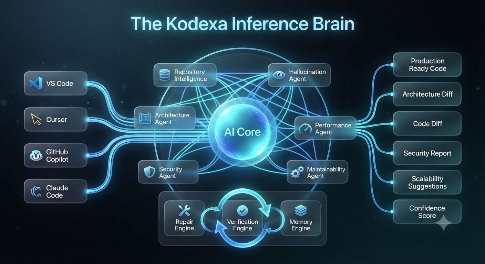

<div align="center">

# Kodexa

### The Inference Engine for AI-Generated Software

**Bridging the gap between AI code generation and production-ready engineering.**

> AI coding agents generate code. Kodexa validates, repairs, and engineers it.

---



</div>

---

# Why Kodexa?

AI coding assistants can build software faster than ever.

They also introduce:

- Hallucinated APIs
- Duplicate abstractions
- Dead code
- Circular dependencies
- Token-heavy implementations
- Security vulnerabilities
- Architecture drift
- Poor maintainability

Current AI coding tools optimize **generation**.

Kodexa optimizes **engineering**.

Instead of acting like another coding assistant, Kodexa sits between AI agents and production, continuously validating and improving generated software before it ships.

---

# The Problem

Today's AI coding workflow is mostly reactive.

```
Prompt
      ↓
Cursor / Copilot / Claude Code
      ↓
Large Pull Request
      ↓
Human Review
      ↓
Production
```

Problems discovered only after generation:

- Hallucinations
- Technical debt
- Duplicate implementations
- Context explosion
- Security issues
- Broken architecture
- Poor scalability

---

# The Kodexa Approach

Kodexa introduces an **Inference Layer** between generation and production.

```
Developer
      ↓
AI Coding Agent
      ↓
Kodexa Inference Engine
      ↓
Verified Production Code
```

Instead of asking:

> "Can AI write code?"

Kodexa asks:

> "Can AI-generated software survive production?"

---

# Architecture

<div align="center">



</div>

Kodexa continuously understands repositories, reasons over architecture, detects hallucinations, predicts future engineering problems, generates repairs, verifies the fixes, and feeds improvements back into the repository.

This creates a continuous engineering loop rather than a one-time code generation workflow.

---

# Core Capabilities

## Repository Intelligence

Understand the repository beyond files.

- Repository graph
- Dependency mapping
- Semantic understanding
- Duplicate abstraction detection
- Context compression

---

## Architecture Review

Analyze software quality rather than syntax.

Detects:

- Hallucinated APIs
- Dead code
- Circular dependencies
- Technical debt
- Scalability bottlenecks
- Architecture smells
- Context bloat

---

## Autonomous Repair

Generate production-grade improvements.

Produces:

- Architectural refactors
- Minimal repair patches
- Dependency cleanup
- Duplicate removal
- Performance improvements
- Token optimization
- Security fixes

---

## Verification Loop

Every generated change is validated.

Verification includes:

- Static analysis
- Type checking
- Linting
- Build validation
- Confidence scoring

---

# Why Kodexa is Different

| AI Coding Assistant | Kodexa |
|---------------------|---------|
| Generates code | Engineers software |
| Focuses on prompts | Understands repositories |
| Reactive | Predictive |
| File-level | Repository-level |
| One-shot generation | Continuous improvement |
| Optimizes completion | Optimizes architecture |

---

# Vision

AI-generated software should be:

- Production-ready
- Maintainable
- Secure
- Scalable
- Verifiable

Kodexa is building the engineering layer that makes this possible.

---

# Roadmap

### Phase 1

- Repository Intelligence
- Architecture Review
- Repository Repair

### Phase 2

- Semantic Repository Graph
- Autonomous Verification Loop
- Architecture Diff Engine
- Context Compression

### Phase 3

- Multi-Agent Inference
- Self-Healing Repositories
- Continuous Engineering
- CI/CD Integration

---

# Built For

- VS Code
- Cursor
- Windsurf
- Claude Code
- GitHub Copilot
- AI-assisted engineering teams

---

# Philosophy

> Generation is easy.

> Engineering is hard.

> **Kodexa bridges the gap.**

---

# Status

🚧 Active Development

The current release focuses on repository understanding, architecture reasoning, autonomous repair, and continuous engineering workflows.

Future versions will introduce autonomous repository improvement and inference-driven software engineering.

---

Made with ❤️ for the future of AI software engineering.
